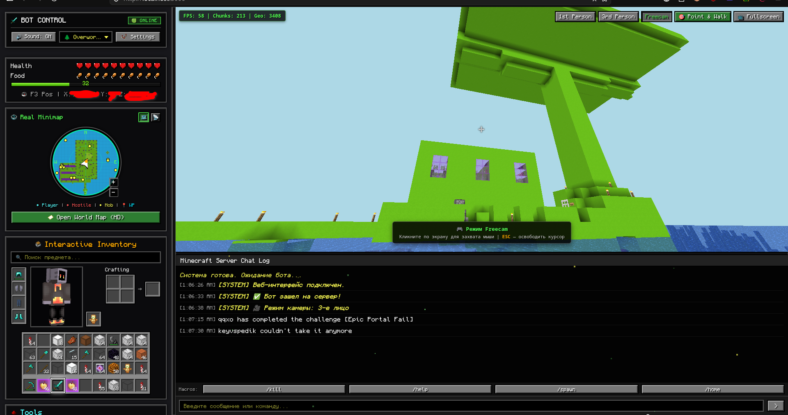

# MC Bot Dashboard — Web Control & Automation Suite



[](https://nodejs.org/)
[](https://github.com/PrismarineJS/mineflayer)
[](https://expressjs.com/)
[](https://socket.io/)

**MC Bot Dashboard** is a feature-rich, 24/7 autonomous Minecraft AFK bot equipped with a real-time web control panel. Designed for farm standing, automated crop harvesting, chest sorting, and AFK protection, it features 3D world viewing, interactive inventory management, live minimap/HD world map rendering, and remote control via Telegram.

---

## Key Features

### 1. 3D World Viewer (Prismarine Viewer)
* **Camera View Modes**:
  * **1st Person**: View the world directly from the bot's eyes.
  * **3rd Person**: View the bot from behind.
  * **Freecam**: Free-roam camera with mouse pointer lock controls.
* **Point & Walk**: Click anywhere within the 3D viewer to make the bot automatically pathfind and walk to that location.
* **Fullscreen Support**: Expand the 3D viewport to full screen for immersive monitoring.

### 2. Interactive Inventory & 3D Avatar
* **Classic Minecraft Layout**: Complete inventory interface featuring armor slots, offhand slot, 2x2 crafting grid, main inventory, and hotbar.
* **3D Player Skin Model**: Interactive 3D player skin rendered with Three.js supporting click-and-drag rotation.
* **Item Search**: Real-time item filtering across all inventory slots.
* **Slot Management**: Drag-and-drop item swapping, quick equipping to hand, and item dropping.
* **Durability Indicators**: Percentage-based durability remaining badges for tools, weapons, and armor.

### 3. Live Minimap & HD World Map
* **Radar & Terrain Minimap**: 2D terrain block renderer around the bot (64-block radius) rotating dynamically with the bot's direction of view.
* **Entity Indicators**:
  * Players
  * Hostile Mobs
  * Passive Mobs
  * Navigation Waypoints
* **HD World Map**: Fullscreen map modal supporting zoom, drag panning, and toggleable layers (Terrain, Relief, Mobs, Waypoints, Coordinate Grid).

### 4. Automation Modules

| Module | Description |
| :--- | :--- |
| **Auto-Farm & Auto-Shear** | Harvest mature crops (wheat, carrots, potatoes, beetroot), replant seeds, shear sheep, and automatically deposit gathered items into nearby chests. |
| **Smart Auto-Chest Sorter** | Locate nearby chests, pick up dropped items from the ground, and sort them into chests by category. |
| **Anti-AFK & Farm Stand Guard** | Prevent AFK kicks during 24/7 farm standing through randomized micro-movements, head turns, and jumps. Automatically pauses during manual control. |
| **Auto-Armor & Auto-Totem** | Automatically equip the highest-tier armor available and keep a Totem of Undying in the offhand slot for safety on farms. |
| **Auto-Eat** | Automatically consume food based on hunger levels and food saturation value. |
| **Durability Manager** | Monitor tool and weapon durability to automatically swap out items before they break. |
| **Patrol Routes & Waypoints** | Save custom coordinate waypoints, pathfind to saved locations, and execute looping or single-run patrol routes. |
| **Anti-Spam Filter** | Suppress repetitive chat spam messages from server chat. |

### 5. Telegram Remote Control & Alerts
* Real-time notifications for server connection, kicks, and critical events.
* Two-way chat relay: forward server messages to Telegram and send Telegram messages into Minecraft chat.
* Remote commands to check status, health, inventory, or toggle bot features.

### 6. Themes & Sound Effects
* **Sound Synthesizer**: Web audio playback for Minecraft sound events (taking damage, collecting XP, opening chests, button clicks).
* **UI Theme Selector**: Customize interface visuals with `Overworld`, `Nether`, `The End`, `Emerald`, `Deep Dark`, and `Redstone` themes.

---

## Project Structure

```text
minecraft/
├── config/                  # Configuration directory
│   ├── config.json          # Active bot and server configuration
│   └── config.example.json  # Configuration template
├── public/                  # Frontend web interface assets
│   ├── index.html           # Main dashboard UI
│   ├── style.css            # Custom Minecraft pixel-art styling
│   ├── js/                  # Client scripts (Map, Radar, Inventory, 3D Skin, Controls, Socket)
│   └── mc_assets/           # Item icons and texture assets
├── src/                     # Node.js backend logic
│   ├── server.js            # Express & Socket.IO server entry point
│   ├── bot.js               # Mineflayer bot core and event handlers
│   ├── telegram.js          # Telegram bot controller
│   ├── logger.js            # Logging utility
│   └── plugins/             # Automation plugins (Auto-Farm, Sorter, Patrol, Anti-AFK, etc.)
└── package.json
```

---

## Getting Started

### Prerequisites
* **Node.js** v18.0.0 or higher
* **npm** v9.0.0 or higher

### 1. Installation
Clone the repository and install dependencies:
```bash
git clone https://github.com/your-username/mc-bot-dashboard.git
cd mc-bot-dashboard
npm install
```

### 2. Configuration
Create a `config/config.json` file based on `config/config.example.json`:
```json
{
  "minecraft": {
    "host": "127.0.0.1",
    "port": 25565,
    "username": "Bot_Worker",
    "version": "1.21.4",
    "auth": "offline",
    "autoReconnect": true,
    "reconnectDelay": 15000
  },
  "server": {
    "port": 3000,
    "viewerPort": 3007
  },
  "telegram": {
    "enabled": false,
    "token": "YOUR_TELEGRAM_BOT_TOKEN",
    "chatId": "YOUR_TELEGRAM_CHAT_ID",
    "forwardMcToTg": true,
    "forwardTgToMc": true,
    "allowedUsers": []
  },
  "botState": {
    "isAttacking": false,
    "isAntiAfk": true,
    "isLooker": false,
    "isAntiSpam": true,
    "autoTotem": true,
    "autoArmor": true,
    "autoEat": true,
    "autoFarm": false,
    "autoShear": false
  },
  "viewer": {
    "firstPerson": false,
    "viewDistance": 4
  }
}
```

### 3. Launching the App
Run the start command:
```bash
npm start
```

Once started, open your web browser and navigate to:  
`http://localhost:3000`

---

## Telegram Commands

When Telegram integration is enabled, the following commands are supported:

| Command | Action |
| :--- | :--- |
| `/status` | View bot status (health, food points, coordinates, connection state). |
| `/health` | View current HP and food levels. |
| `/coords` | Get exact X, Y, Z position coordinates. |
| `/players` | List online players and latency. |
| `/inventory` | List items currently in inventory. |
| `/say <message>` | Send a message to Minecraft chat as the bot. |
| `/attack <on/off>` | Enable or disable auto-attack mode. |
| `/antiafk <on/off>` | Enable or disable Anti-AFK protection. |
| `/stop` | Clear active pathfinding targets and halt all movement. |
| `/reconnect` | Force restart the bot connection. |

---

## Tech Stack

* **Backend**: Node.js, Express 5, Socket.IO
* **Minecraft Protocol**: [Mineflayer](https://github.com/PrismarineJS/mineflayer), mineflayer-pathfinder, mineflayer-auto-eat, prismarine-viewer, minecraft-data
* **Frontend**: HTML5, Vanilla CSS3, JavaScript (ES6+), Three.js, Canvas API
* **Integrations**: `node-telegram-bot-api`
